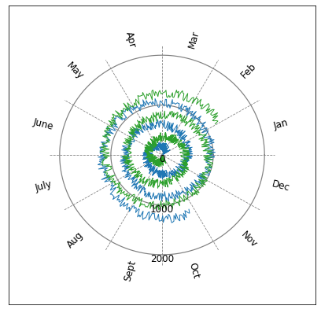

# Circular Plots


```python
import matplotlib.pyplot as plt
import numpy as np
import CircularPlot as CP
```

## Basic Circular Plot


```python
# Make example data
x = np.linspace(0, 50, 1000)
y1 = x**0.7 + np.random.rand(len(x)) + np.cos(4*x)
xmax = 10
ymax = 20
plt.figure(figsize = (7,7))
yticks = [5, 10, 15]

# Plot data
CP.circularPlot(x, y1, xmax, ymax, color = "tab:red", yticks = yticks,
             num_xticks = 12, ytitle = "Example y title")
y2 = x**0.7 + np.random.rand(len(x))
CP.circularPlot(x, y2, xmax, ymax, grid = False)
```





## Circular Plot with Dates


```python
import datetime

# Make example data
num_dates = 1000
year_start = datetime.date(2015, 1, 1)
all_dates = np.array([year_start + datetime.timedelta(days=i) for i in range(num_dates)])
y = np.linspace(0, 1200, num_dates)+200*np.random.rand(num_dates)

# Plot data
plt.figure(figsize = (7,7))
yticks = [0, 1000]
CP.circularDatePlot(all_dates, y, ymax = 2000, yticks = yticks, color = "tab:blue")
CP.circularDatePlot(all_dates, y[::-1], ymax = 2000, color = "tab:green", grid = False)

```


```python

```
